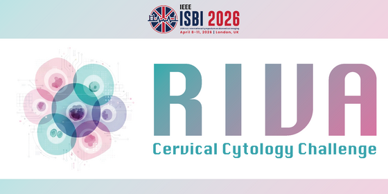
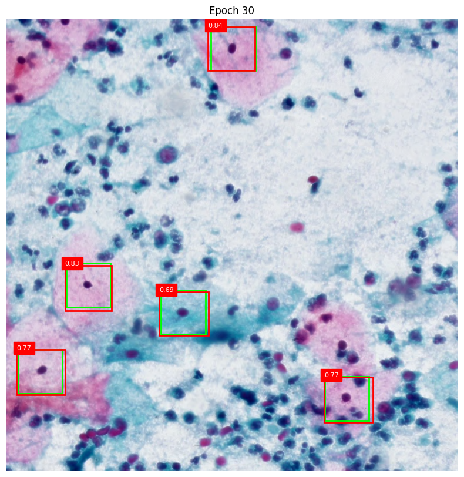

# RIVA-challenge

<p align="center">
    <a href="https://www.kaggle.com/competitions/riva-cervical-cytology-challenge-isbi-2026/overview">
        
    </a>
</p>

This repository is our solution to the [RIVA Cervical Cytology Challenge](https://www.kaggle.com/competitions/riva-cervical-cytology-challenge-isbi-2026/overview) Track A in the context of ISBI 2026.

This project has the objective of finding the best architecture in order to both detect and classify cells of the Bethesda categories (NILM, ASCUS, LSIL, HSIL, ASC-H, SCC, INFL, ENDO).

The first model architecture that we proposed consisted of using [SAM3](https://arxiv.org/pdf/2511.16719)'s vision encoder as a backbone of [Faster-RCNN](https://arxiv.org/pdf/1506.01497). It  is a combination of a SOTA model (SAM3) and a well established one (Faster-RCNN). This one gave us the best performance of all three proposed architectures.

The second model architecture, also uses SAM3's vision encoder but this time as a backbone of [DETR](https://arxiv.org/pdf/2005.12872). This version of the model is much newer and takes advantage of the current Transfomer based architectures. 

The third model architecture, uses [Cell-DINO](https://journals.plos.org/ploscompbiol/article?id=10.1371/journal.pcbi.1013828) as a backbone of Faster-RCNN. We hypthesized that this model would profit from the pretraining of the backbone on cell images, leading to a stronger performance on the RIVA dataset. In our case it did not end up being the case. Probably due a lack of volume of data and difficult data distribution.

This last two models underperformed compared to the first one, despite this being the case, the code from them is available.

We experimented with [LoRA](https://arxiv.org/pdf/2106.09685) finetuning on the Cell-DINO + Faster-RCNN and SAM3 + DETR models. We also experimented with [learnable anchors](https://arxiv.org/pdf/1812.00469), [focal loss](https://arxiv.org/pdf/1708.02002) and [weighted random sampling](https://www.sciencedirect.com/science/article/pii/S002001900500298X) as ablations to our SAM3 + Faster-RCNN model.

> Training the LoRA models is currently not supported.

## 🎖 Results

Our best score on the final test set was a **mAP of 0.12064** while our best score on the pre-eliminary phase test set was a **mAP of 0.15705**. That placed us on 11th place and 21th place respectively. The model that gave us those results was the revisited (v2) SAM3 + Faster-RCNN with out best anchor generator configuration. All other ablations gave us an inferior performance. 

## 🚀 Quick start
Start by downloading the projects dependencies by running
```cli
pip install -r requirements.txt
```

To access the challenges training, validating and testing datasets with their respective annotations simply run ensuring you are already participating in the challenge. For the pre-eliminary phase dataset run:
```cli
kaggle competitions download -c riva-cervical-cytology-challenge-isbi-2026
```
And for the final phase dataset (it only differs on the test set) run:
```cli
kaggle competitions download -c riva-cervical-cytology-challenge-track-a-isbi-final-evaluation
```

## 🦾 Training
First choose which model you want to train from the ones that are in "models/" and then run:
```cli
python train.py --model <MODEL_NAME>
```
The only valid model names for this script are: 
- **sam3_rcnn** for the SAM3 + Faster-RCNN 
- **sam3_detr** for the SAM3 + DETR
- **sam3_rcnn_v2** for the *revisited* SAM3 + Faster-RCNN

We also have two other specific training loops: one for the *revisited* SAM3 + DETR and one for the Cell-DINO + Faster-RCNN model.

To train the revisited SAM3 + DETR run:
```cli
python train_sam3_detr_v2.py
```

Before training the Cell-DINO model, you must obtain the pretrained weights by completing the requested information in the following link: https://ai.meta.com/resources/models-and-libraries/cell-dino-downloads/.
After that, you should receive an email with the url's to the weights. The one to use is
**cell_dino_vitl14_pretrain_hpa_fov_highres-*.pth**

The training script for Cell-DINO + Faster-RCNN is much simpler. It can be run with:
```cli
python train_cell_dino.py
```
Provide the pretrained weights path to the script for easier use.

> In case of not knowing how to use the training scripts, you can always run `python <SCRIPT_NAME>.py --help` to see the available arguments and a little explanation of what they do.

## 📖 Testing
To run the functionality tests run:
```
pytest tests/
```
To run the overfit script run:
```cli
python tests/overfit_tests/overfit_models.py --model <MODEL_NAME>
```

Supported models are: 'cell_dino', 'cell_dino_lora', 'sam3', 'sam3_detr_v2' ('sam3' is the non revisited SAM3 + Faster-RCNN model).

Images like the following will be saved (every 10 epochs by default) to overfit_visualizations_<MODEL_NAME>. In red the predicted bounding box and in green, the ground truth.



## 📁 Generating predictions

To generate predictions over the test dataset run:
```cli
python predict.py --model <MODEL_NAME>
```
Supported models are: 'sam3_rcnn', 'sam3_rcnn_v2', 'sam3_detr', 'cell_dino_rcnn_v2', 'cell_dino'.

This will generate a submission.csv file in the "results/" directory.

> Predictions for the LoRA models are currently not fully supported. The script must be revisited before they can be used.

##  📜 References

If you use this code in your research, please cite:

```bibtex
@misc{carion2025sam3segmentconcepts,
      title={SAM 3: Segment Anything with Concepts}, 
      author={Nicolas Carion and Laura Gustafson and Yuan-Ting Hu and Shoubhik Debnath and Ronghang Hu and Didac Suris and Chaitanya Ryali and Kalyan Vasudev Alwala and Haitham Khedr and Andrew Huang and Jie Lei and Tengyu Ma and Baishan Guo and Arpit Kalla and Markus Marks and Joseph Greer and Meng Wang and Peize Sun and Roman Rädle and Triantafyllos Afouras and Effrosyni Mavroudi and Katherine Xu and Tsung-Han Wu and Yu Zhou and Liliane Momeni and Rishi Hazra and Shuangrui Ding and Sagar Vaze and Francois Porcher and Feng Li and Siyuan Li and Aishwarya Kamath and Ho Kei Cheng and Piotr Dollár and Nikhila Ravi and Kate Saenko and Pengchuan Zhang and Christoph Feichtenhofer},
      year={2025},
      eprint={2511.16719},
      archivePrefix={arXiv},
      primaryClass={cs.CV},
      url={https://arxiv.org/abs/2511.16719}, 
}

@misc{ren2016fasterrcnnrealtimeobject,
      title={Faster R-CNN: Towards Real-Time Object Detection with Region Proposal Networks}, 
      author={Shaoqing Ren and Kaiming He and Ross Girshick and Jian Sun},
      year={2016},
      eprint={1506.01497},
      archivePrefix={arXiv},
      primaryClass={cs.CV},
      url={https://arxiv.org/abs/1506.01497}, 
}

@misc{carion2020endtoendobjectdetectiontransformers,
      title={End-to-End Object Detection with Transformers}, 
      author={Nicolas Carion and Francisco Massa and Gabriel Synnaeve and Nicolas Usunier and Alexander Kirillov and Sergey Zagoruyko},
      year={2020},
      eprint={2005.12872},
      archivePrefix={arXiv},
      primaryClass={cs.CV},
      url={https://arxiv.org/abs/2005.12872}, 
}

@misc{,
  title={Cell-DINO: Self-Supervised Image-based Embeddings for Cell Fluorescent Microscopy},
  author={Moutakanni, Th\'eo and Couprie, Camille and Yi, Seungeun and Gardes, Elouan Gardes and Bojanowski, Piotr and Touvron, Hugo and Doron, Michael and Chen, Zitong S. and Moshkov, Nikita and Caron, Mathilde and Joulin, Armand and Pernice, Wolfgang M. and Caicedo, Juan C.},
  journal={in review to PloS One on Computational Biology},
  year={2025}
}

@misc{hu2021loralowrankadaptationlarge,
      title={LoRA: Low-Rank Adaptation of Large Language Models}, 
      author={Edward J. Hu and Yelong Shen and Phillip Wallis and Zeyuan Allen-Zhu and Yuanzhi Li and Shean Wang and Lu Wang and Weizhu Chen},
      year={2021},
      eprint={2106.09685},
      archivePrefix={arXiv},
      primaryClass={cs.CL},
      url={https://arxiv.org/abs/2106.09685}, 
}

@misc{zhong2020anchorboxoptimizationobject,
      title={Anchor Box Optimization for Object Detection}, 
      author={Yuanyi Zhong and Jianfeng Wang and Jian Peng and Lei Zhang},
      year={2020},
      eprint={1812.00469},
      archivePrefix={arXiv},
      primaryClass={cs.CV},
      url={https://arxiv.org/abs/1812.00469}, 
}

@misc{lin2018focallossdenseobject,
      title={Focal Loss for Dense Object Detection}, 
      author={Tsung-Yi Lin and Priya Goyal and Ross Girshick and Kaiming He and Piotr Dollár},
      year={2018},
      eprint={1708.02002},
      archivePrefix={arXiv},
      primaryClass={cs.CV},
      url={https://arxiv.org/abs/1708.02002}, 
}

@article{EFRAIMIDIS2006181,
title = {Weighted random sampling with a reservoir},
journal = {Information Processing Letters},
volume = {97},
number = {5},
pages = {181-185},
year = {2006},
issn = {0020-0190},
doi = {https://doi.org/10.1016/j.ipl.2005.11.003},
url = {https://www.sciencedirect.com/science/article/pii/S002001900500298X},
author = {Pavlos S. Efraimidis and Paul G. Spirakis},
keywords = {Weighted random sampling, Reservoir sampling, Randomized algorithms, Data streams, Parallel algorithms},
abstract = {In this work, a new algorithm for drawing a weighted random sample of size m from a population of n weighted items, where m⩽n, is presented. The algorithm can generate a weighted random sample in one-pass over unknown populations.}
}

@misc{riva-cervical-cytology-challenge-isbi-2026,
    author = {Emmanuel Iarussi and Manuel Andrade},
    title = {RIVA Cervical Cytology Challenge - Track A (ISBI)},
    year = {2025},
    howpublished = {\url{https://kaggle.com/competitions/riva-cervical-cytology-challenge-isbi-2026}},
    note = {Kaggle}
}

@misc{riva-cervical-cytology-challenge-track-a-isbi-final-evaluation,
    author = {Emmanuel Iarussi and Manuel Andrade},
    title = {RIVA CCC - Track A (ISBI) - FINAL EVALUATION},
    year = {2026},
    howpublished = {\url{https://kaggle.com/competitions/riva-cervical-cytology-challenge-track-a-isbi-final-evaluation}},
    note = {Kaggle}
}
```